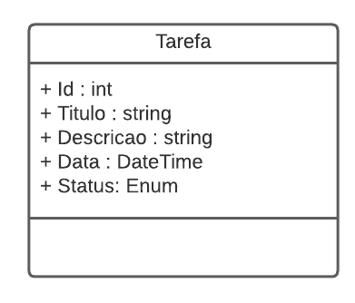

<br>

<p align="center"></p>

<h1 align="center">DIO - Trilha .NET - API e Entity Framework</h1>
<h2 align="center">Desafio: Construindo um Sistema de Agendamento de Tarefas com Entity Framework</h2>

<br>

> Para este desafio, você precisará usar seus conhecimentos adquiridos no módulo de API e Entity Framework, da trilha .NET da DIO.

<br>

## 💻:  Contexto
Você precisa construir um sistema gerenciador de tarefas, onde você poderá cadastrar uma lista de tarefas que permitirá organizar melhor a sua rotina.

Essa lista de tarefas precisa ter um CRUD, ou seja, deverá permitir a você obter os registros, criar, salvar e deletar esses registros.

A sua aplicação deverá ser do tipo Web API ou MVC, fique a vontade para implementar a solução que achar mais adequado.

A sua classe principal, a classe de tarefa, deve ser a seguinte:

<br>

<p align="center"></p>

<br>

Não se esqueça de gerar a sua migration para atualização no banco de dados.

<br>

## 📋: Métodos esperados
É esperado que você crie o seus métodos conforme a seguir:

**Swagger**

<br>

<p align="center"></p>

<br>

**Endpoints**

<br>

| Verbo  | Endpoint                | Parâmetro | Body          |
|--------|-------------------------|-----------|---------------|
| GET    | /Tarefa/{id}            | id        | N/A           |
| PUT    | /Tarefa/{id}            | id        | Schema Tarefa |
| DELETE | /Tarefa/{id}            | id        | N/A           |
| GET    | /Tarefa/ObterTodos      | N/A       | N/A           |
| GET    | /Tarefa/ObterPorTitulo  | titulo    | N/A           |
| GET    | /Tarefa/ObterPorData    | data      | N/A           |
| GET    | /Tarefa/ObterPorStatus  | status    | N/A           |
| POST   | /Tarefa                 | N/A       | Schema Tarefa |

<br>

Esse é o schema (model) de Tarefa, utilizado para passar para os métodos que exigirem

```json
{
  "id": 0,
  "titulo": "string",
  "descricao": "string",
  "data": "2022-06-08T01:31:07.056Z",
  "status": "Pendente"
}
```

<br>

## 🔍: Solução
O código está pela metade, e você deverá dar continuidade obedecendo as regras descritas acima, para que no final, tenhamos um programa funcional. Procure pela palavra comentada "TODO" no código, em seguida, implemente conforme as regras acima.

<br><hr><br>

## 🔗: Links e Referencias:

- **Sobre o Bootcamp**: https://www.dio.me/bootcamp/gft-start-7-net
- **DIO.me**: https://www.dio.me/